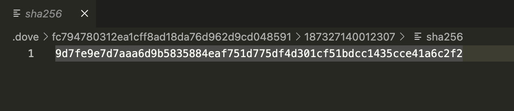
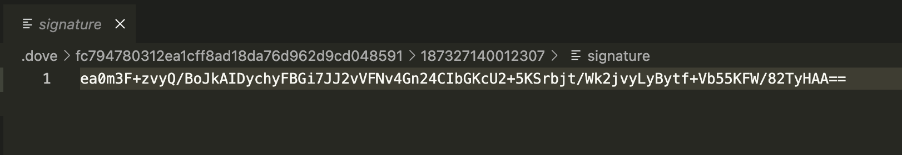
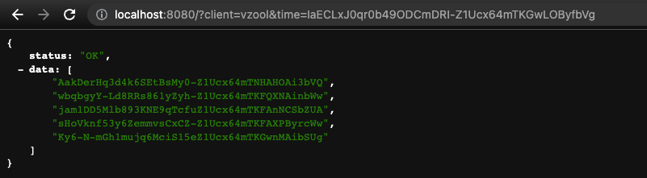
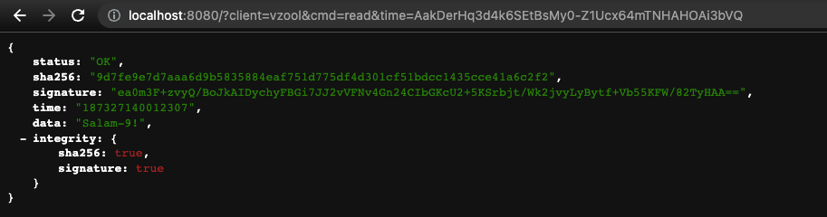
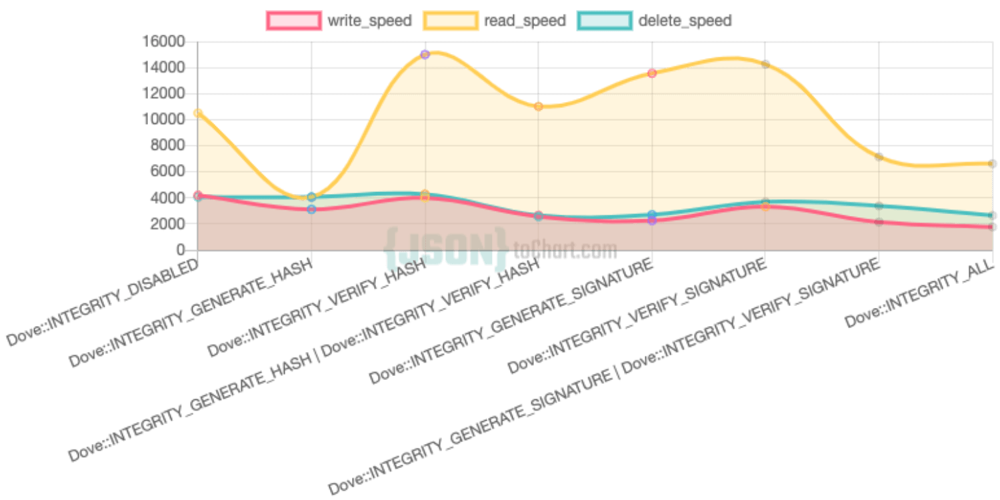

# :bird: الحمامة للتنبيه بنظام الملفات
#### Dove Notification File System (DNFS)

<p>
<a href="https://github.com/vzool/dove.php/blob/main/README.md"></a>
<a href="https://github.com/vzool/dove.php/actions"></a>
<a href="https://packagist.org/packages/vzool/dove.php"></a>
<a href="https://packagist.org/packages/vzool/dove.php"></a>
<a href="https://packagist.org/packages/vzool/dove.php"></a>
</p>

<div dir="rtl">

`الحمامة (Dove)` هو نظام إعلام يعتمد على نظام تخزين الملفات لتسليم الرسائل، وهو يعمل كتدفق أحادي الاتجاه للبيانات من الخادم إلى العملاء.
لذلك، يضع الخادم الرسائل فقط، وبعد ذلك سيتحقق العملاء من وجود أي تحديثات وفق جداولهم الخاصة.
</div>


<div dir="rtl">

سيقوم DNFS افتراضيًا بتخزين جميع بياناته في دليل `.dove` في نفس الدليل حيث يوجد `dove.php` ،ويمكن تغيير ذلك عن طريق وسيطة `$path` في المُنشئ (constructor):
</div>


```php
# المنشئ (constructor)
$dove = new Dove(
    string $client, # عنوان العميل المستخدم للإشارة
    int $expiration_in_days = 0, # معطل افتراضيًا ، قم بالتخزين إلى الأبد دون إزالة أي ملف
    int $integrity = Dove::INTEGRITY_ALL, # مستوى سلامة الرسائل
    string $cmd = '*', # جميع الأوامر مسموح بها ، وإلا ابدأ بمُنشئ محدود بدون أمر `Push`.
    string $path = __DIR__ . '/'
);
```

<div dir="rtl">

لا يعالج `الحمامة (Dove)` البيانات المرسلة أو المستلمة بأي طريقة مثل التشفير أو الترميز ، لذا فهو يعمل كجسر لنقل البيانات من الخادم إلى العملاء. إذا كانت لديك بعض المخاوف مثل البيانات الثنائية ، فما عليك سوى تشفيرها باستخدام `base64` وللحفاظ على الخصوصية استخدام التشفير، كل ذلك تُرك لخيارات المطور.
</div>

<div dir="rtl">

يتم تخزين "انتهاء صلاحية الرسائل" مؤقتًا في ذاكرة الطلب عند إنشاء مثيل جديد لكائن `الحمامة (Dove)`، افتراضيًا تكون قيمته صفرًا مما يعني تعطيل ، وإلا فسيكون في غضون أيام. إذا تم تعطيل انتهاء الصلاحية، فسيقوم `DNFS` بتخزين جميع الرسائل دون حذف أي منها. لذلك ، يتم حساب عملية الحذف بعد انتهاء الصلاحية وإزالة الرسائل القديمة عند إجراء مكالمة سحب مع عميل معين.
</div>

<div dir="rtl">

`DNFS` هو ممثل كسول ولا يتطلب أي مهمة مجدولة لتكون نشطة من أجل القيام بعملها ، فهي تنتظر إجراء العميل فقط لتحديث حالة الرسالة.
</div>

<div dir="rtl">

"النزاهة" هي جزء من انعدام الثقة الذي تأمل `الحمامة (Dove)` في تقديمه ،ولديها العديد من الخيارات:
</div>

```php
class Dove{
    const INTEGRITY_DISABLED = 0b0000;
    const INTEGRITY_GENERATE_HASH = 0b0001;
    const INTEGRITY_VERIFY_HASH = 0b0010;
    const INTEGRITY_GENERATE_SIGNATURE = 0b0100;
    const INTEGRITY_VERIFY_SIGNATURE = 0b1000;
    const INTEGRITY_ALL = 0b1111; # إنشاء وتحقق من العصارة والتوقيع
    # ...
}
```

<div dir="rtl">

بشكل عام ، سيحدث إنشاء العصارة والتوقيع عندما يتم دفع رسالة جديدة بواسطة أمر الدفع (`Push`) ويحدث التحقق عند استدعاء أمر القراءة (`Read`).

الخيار الأسرع هو `Dove::INTEGRITY_DISABLED` ثم (`Dove::INTEGRITY_GENERATE_HASH` أو `Dove::INTEGRITY_VERIFY_HASH`) ، ثم (`Dove::INTEGRITY_GENERATE_SIGNATURE` أو `Dove::INTEGRITY_VERIFY_SIGNATURE`)، بينما الخيار الأبطأ هو `Dove::INTEGRITY_ALL` وذلك يعتمد على حجم الرسالة. لذلك ، عليك يرجى إجراء قياس معياري (Benchmarking) لتحديد الخيار الأفضل.
</div>

<div dir="rtl">

لبدء عمل الخادم، يمكن استخدام واجهة مختلفة مشابهة لواجهة المنشئ (`constructor`):
</div>

```php
Dove::Serve(
    true, # منع إكمال تنفيذ البرمجة بعد النداء
    int $expiration_in_days = 0, # معطل افتراضيًا ، قم بالتخزين إلى الأبد دون إزالة أي ملف
    int $integrity = Dove::INTEGRITY_ALL, # مستوى سلامة الرسائل
    string $path = __DIR__ . '/'
);
```

<div dir="rtl">

بالنسبة إلى معلمة التكامل `integrity` ، فهي متغير أحادي `bitwise` يمكنك الجمع بين خيارات متعددة في وقت واحد مثل ما يلي:
</div>

```php
$dove = new Dove(
    # ..
    Dove::INTEGRITY_GENERATE_HASH | Dove::INTEGRITY_GENERATE_SIGNATURE, # توليد كل شيء دون التحقق
    # ..
);

# وكذلك

Dove::Serve(
    # ..
    Dove::INTEGRITY_GENERATE_HASH | Dove::INTEGRITY_GENERATE_SIGNATURE, # توليد كل شيء دون التحقق
    # ..
);
```

### :no_entry: مصفوفة التشفير (Cryptography Matrix)

<div dir="rtl">

يقتصر التشفير فقط كخيار لتكامل الرسائل أثناء النقل فقط ، حيث يقوم `الحمامة (Dove)` بتسليم الرسائل كما هي ، دون أي تشفير أو تركيز لمحتويات الرسالة.
</div>

| الوظيفة(Function)      | الشيفرة (Cipher) |   اختياري (Optional) | قابل للتغيير (Changeable)  |
| ----------- | ----------- | -----------  | -----------    |
| مرجعيات العملاء (Client Reference)      | BLAKE2b      |  **لا** |  **لا** |
| عصارة محتوى الرسالة (Message Hash)   | SHA-256        |  نعم |  **لا** |
| التوقيع الرقيم لمحتوى الرسالة (Message Signature)   | Ed25519        |  نعم |  **لا** |
| ترميز التوقيع الرقمي لمحتوى الرسالة (Signature Encoding)   | base64        |  نعم |  **لا** |
| تشفير مواقيت الرسائل (Times Encyption)   | Xsals20 + Poly1305        |  **لا** |  **لا** |
| ترميز مواقيت الرسائل (Times Encoding)   | base64url         |  **لا** |  **لا** |


### :sparkles: الحافز لفكرة المشروع (Motivation)
<div dir="rtl">

جاءت الفكرة الرئيسية من محادثات مشروع [Passky-Server](https://github.com/Rabbit-Company/Passky-Server) على خادم [discord server](https://discord.gg/y2ZBKbW5TA) حول ما حدث لخرق بيانات LastPass، والذي يؤثر على معلومات التعريف الشخصية (PII) ويسمح لممثل سيء باستخدام هذه المعلومات لشن هجوم تصيد.
كان هناك العديد من الأفكار المشتركة، إحداها كان [Zica Zajc](https://github.com/zigazajc007) وهو رجل عظيم والمدير التنفيذي لمشروع Passky، واقترح أن الخادم يمكنه تخزين الرسائل وسيقوم العملاء بفحصها لاحقًا.
لذلك ، اعتقدت أنه سيكون من الأفضل للجميع دمج هذه الفكرة في مكتبة قابلة للاستخدام.
</div>

### :eyes: تشريح المكتبة (Anatomy)

<div dir="rtl">

`الحمامة (Dove)` هي مكتبة صغيرة جدًا تقل عن 180 سطر (سطور من التعليمات البرمجية أو LOC - lines of code) ، واستغرق التنفيذ الأساسي حوالي 59٪ فقط ، و 10٪ لمعالجة HTTP والباقي للاختبار.
</div>

<div dir="rtl">

نعم ، ملف واحد يحتوي على كل منهم ، ملف `dove.php` يحتوي على التنفيذ ، وجهاز توجيه HTTP ، والاختبار ، أليس هذا رائعًا؟ :yum::v:
</div>

<div dir="rtl">

في الواقع ، `الحمامة (Dove)` هي مكتبة خاصة يمكنك من خلالها استخدام الملف الفردي `dove.php` ، أو تثبيته عبر composer دون الحاجة إلى مساحات أسماء. ستجعلك هاتان الطريقتان تستخدم الوظائف الكاملة للمكتبة.
</div>

**هيكلة بيانات نظام الحمامة لتخزين الملفات - Dove Storage Data Structure (DSDS)**


<div dir="rtl">

يمكن أن يكون دليل `.dove` في مسار عام بميزة سرد الدليل إذا كان يدعمه خادم الويب، ولكن يمكنك أيضًا وضعه في موقع خاص وسيكون DNFS هو نقطة الوصول الوحيدة إلى هذه البيانات.
</div>





**طلب السحب - REST API Pull Request**


<div dir="rtl">
كانت تلك قائمة بالأوقات ، بترتيب تنازلي من الأحدث إلى القديم. لذلك ، من خلال تحديد وقت يمكنك طلب أحدث الرسائل بعد ذلك الوقت ، أو قراءة محتويات الرسالة.
</div>

**طلب السحب بعد وقت محدد - REST API Pull Request After Some Time**



**طلب السحب بعد آخر توقيت - REST API Pull Request After Last Time**


**طلب قراءة الرسالة - REST API Read Request**



<div dir="rtl">

يحاول DNFS تطبيق عدم الثقة من خلال وضع حد واضح بين الداخل والخارج ، لذلك فهو دائمًا ما يشفر الأوقات تلقائيًا ، وسيتم تغيير المفتاح المستخدم للتشفير / فك التشفير تلقائيًا ، وفقًا لمحتويات وموقع `dove.php` أو حالته.

إذا تغيرت هوية `dove.php` عندها المجلد `.dove` بالكامل سوف يتم حذفه بشكل آلي.

لذلك ، إذا حصل العميل على بعض المراجع الزمنية ، فسيتم تحديث محتويات `dove.php` بطريقة ما أو تم تغيير موقع الملف ، فلن تعمل المراجع القديمة ما لم يطلب العميل مراجع جديدة ، ومن ثم يمكن للعميل الحصول على بقية الرسائل ذات المراجع المحدثة.
</div>

**طلب قراءة الرسالة بتوقيع رقمي غير مطابق - REST API Read Request with Invalid Signature**


<div dir="rtl">

هنا يكون التوقيع (signature) غير صالح بينما صلاحية العصارة (hash) كذلك، لأن العصارة تتعلق بمحتوى الرسالة فقط ، بينما يتضمن التوقيع الكود المصدري لـ `dove.php` نفسه كمصدر للحقيقة ، والتي تغيرت وجعلت كل أزواج المفاتيح الجديدة ، إذن جميع التوقيعات السابقة غير صالحة بشكل افتراضي.
في الوضع الطبيعي ، وأثناء إرسال الرسائل ، لا ينبغي تغيير ملف `dove.php` ، إلا إذا كان هناك تحديث عاجل ، لذلك يمكن للمطور لاحقًا تحديد ما إذا كان هذا مقبولاً أو إلغاء جميع الرسائل وإنشاء أخرى جديدة إذا بحاجة.
</div>

**طلب قراءة رسالة غير متوفرة - REST API Read Request with Missing Message**


### :office: المتطلبات

- PHP 7.3+

### :anchor: التثبيت والاستخدام
<div dir="rtl">

سيبذل مشروع `الحمامة (Dove)` قصارى جهده ليكون متوافقًا مع جميع إصداراته التي تم إصدارها ، لذلك في إصدارات التطوير المستقبلية ، لن تكون هناك تغييرات جذرية.
</div>

#### :wrench: مكتبة الملف الواحد - Single File Library (من جانب الخادم)

<div dir="rtl">

المكتبة بأكملها عبارة عن ملف واحد يسمى `dove.php` ، لذا يمكنك نسخه ولصقه في أي مكان ذي صلة بك.
</div>

<div dir="rtl">
استخدم ما يلي عندما تريد معالجة الرسائل:
</div>

```php
<?php

define('DOVE', 1);
require_once 'dove.php';

$dove = new Dove('abdelaziz');
$result = $dove->Push('Salam, World!');
$message = $dove->Read($result['time']); # قراءة رسالة في توقيت محدد

$times = $dove->Pull($result['time']); # سحب كل مواقيت الرسائل بعد توقيت محدد
$times = $dove->Pull(); # سحب كل مواقيت الرسائل

$dove->Delete($result['time']); # حذف رسالة واحدة فقط
$dove->Delete(); # حذف كل الرسائل
?>
```

<div dir="rtl">
بعد ذلك ، للتعامل مع طلبات العميل ، قم بتشغيل ما يلي:
</div>

```shell
php -S localhost:8080 dove.php
```

#### :musical_note: مدير الحزم البرمجية - [Composer](https://getcomposer.org/) Dependency Manager for PHP (من جانب الخادم)

```shell
composer require vzool/dove.php
```

<div dir="rtl">
استخدم ما يلي عندما تريد معالجة الرسائل:
</div>

```php
<?php

define('DOVE', 1);
require_once 'vendor/vzool/dove.php/dove.php';

$dove = new Dove('abdelaziz');
$result = $dove->Push('Salam, World!');
$message = $dove->Read($result['time']); # قراءة رسالة في توقيت محدد
# ...
?>
```

<div dir="rtl">

بعد ذلك، للتعامل مع طلبات العميل ، قم فقط بتضمين ذلك في مسار `$ _REQUEST` وسوف يتعامل مع الطلبات تلقائيًا.
</div>

```php
<?php require_once 'vendor/vzool/dove.php/dove.php'; ?>

# أو

<?php
    define('DOVE', 1);
    require_once 'vendor/vzool/dove.php/dove.php';
    Dove::Serve(true);
?>
```

#### :earth_africa: HTTP REST API (من جانب العميل) [GET/POST/ANY]

<div dir="rtl">

- اسحب جميع أوقات الرسائل:
    - `http://localhost:8080/dove.php?client=abdelaziz&cmd=pull`
    أو
    - `http://localhost:8080/dove.php?client=abdelaziz`

- سحب آخر أوقات الرسائل بعد الوقت (369):
    - `http://localhost:8080/dove.php?client=abdelaziz&cmd=pull&time=369`
    أو
    - `http://localhost:8080/dove.php?&client=abdelaziz&time=369`

- سحب اخر اوقات الرسائل بعد الوقت (369) `http://localhost:8080/dove.php?client=abdelaziz&cmd=read&time=369`
</div>

### :checkered_flag: قياس الأداء (Benchmark)

<div dir="rtl">

- المعالج (CPU): 3.7 GHz 6-Core Intel Core i5
- ذاكرة الوصول العشوائية (RAM): 72 GB 2667 MHz DDR4
- نظام التشغيل (OS): masOS Ventura 13.1
</div>



```shell


INTEGRITY_TYPE = Dove::INTEGRITY_DISABLED

==========================================================================
Dove Benchmarking started at: 2023-02-20 14:04:55
==========================================================================
Write messages for (00:00:30) ...
Write finished on: 2023-02-20 14:05:26
--------------------------------------------------------------------------
Read all written messages...
Read finished on: 2023-02-20 14:05:38
--------------------------------------------------------------------------
Delete all written messages...
Delete finished on: 2023-02-20 14:06:09
==========================================================================
Write Count 126,061 (msg) in (00:00:30)
Write Speed 4,202 (msg/sec).
--------------------------------------------------------------------------
Read Count 126,061 (msg) in (00:00:12)
Read Speed 10,505 (msg/sec).
--------------------------------------------------------------------------
Delete Count 126,061 (msg) in (00:00:31)
Delete Speed 4,066 (msg/sec).
--------------------------------------------------------------------------
Average Count 126,061 (msg).
Average Speed 6,258 (msg/sec).
==========================================================================
Dove Benchmarking done at: (2023-02-20 14:06:09) and took (00:01:13)
==========================================================================


INTEGRITY_TYPE = Dove::INTEGRITY_GENERATE_HASH

==========================================================================
Dove Benchmarking started at: 2023-02-20 14:06:09
==========================================================================
Write messages for (00:00:30) ...
Write finished on: 2023-02-20 14:06:40
--------------------------------------------------------------------------
Read all written messages...
Read finished on: 2023-02-20 14:07:03
--------------------------------------------------------------------------
Delete all written messages...
Delete finished on: 2023-02-20 14:07:26
==========================================================================
Write Count 93,540 (msg) in (00:00:30)
Write Speed 3,118 (msg/sec).
--------------------------------------------------------------------------
Read Count 93,540 (msg) in (00:00:23)
Read Speed 4,067 (msg/sec).
--------------------------------------------------------------------------
Delete Count 93,540 (msg) in (00:00:23)
Delete Speed 4,067 (msg/sec).
--------------------------------------------------------------------------
Average Count 93,540 (msg).
Average Speed 3,751 (msg/sec).
==========================================================================
Dove Benchmarking done at: (2023-02-20 14:07:26) and took (00:01:16)
==========================================================================


INTEGRITY_TYPE = Dove::INTEGRITY_VERIFY_HASH

==========================================================================
Dove Benchmarking started at: 2023-02-20 14:07:26
==========================================================================
Write messages for (00:00:30) ...
Write finished on: 2023-02-20 14:07:57
--------------------------------------------------------------------------
Read all written messages...
Read finished on: 2023-02-20 14:08:05
--------------------------------------------------------------------------
Delete all written messages...
Delete finished on: 2023-02-20 14:08:33
==========================================================================
Write Count 119,980 (msg) in (00:00:30)
Write Speed 3,999 (msg/sec).
--------------------------------------------------------------------------
Read Count 119,980 (msg) in (00:00:08)
Read Speed 14,998 (msg/sec).
--------------------------------------------------------------------------
Delete Count 119,980 (msg) in (00:00:28)
Delete Speed 4,285 (msg/sec).
--------------------------------------------------------------------------
Average Count 119,980 (msg).
Average Speed 7,761 (msg/sec).
==========================================================================
Dove Benchmarking done at: (2023-02-20 14:08:33) and took (00:01:06)
==========================================================================


INTEGRITY_TYPE = Dove::INTEGRITY_GENERATE_HASH | Dove::INTEGRITY_VERIFY_HASH

==========================================================================
Dove Benchmarking started at: 2023-02-20 14:08:33
==========================================================================
Write messages for (00:00:30) ...
Write finished on: 2023-02-20 14:09:04
--------------------------------------------------------------------------
Read all written messages...
Read finished on: 2023-02-20 14:09:11
--------------------------------------------------------------------------
Delete all written messages...
Delete finished on: 2023-02-20 14:09:40
==========================================================================
Write Count 77,086 (msg) in (00:00:30)
Write Speed 2,570 (msg/sec).
--------------------------------------------------------------------------
Read Count 77,086 (msg) in (00:00:07)
Read Speed 11,012 (msg/sec).
--------------------------------------------------------------------------
Delete Count 77,086 (msg) in (00:00:29)
Delete Speed 2,658 (msg/sec).
--------------------------------------------------------------------------
Average Count 77,086 (msg).
Average Speed 5,413 (msg/sec).
==========================================================================
Dove Benchmarking done at: (2023-02-20 14:09:40) and took (00:01:06)
==========================================================================


INTEGRITY_TYPE = Dove::INTEGRITY_GENERATE_SIGNATURE

==========================================================================
Dove Benchmarking started at: 2023-02-20 14:09:40
==========================================================================
Write messages for (00:00:30) ...
Write finished on: 2023-02-20 14:10:11
--------------------------------------------------------------------------
Read all written messages...
Read finished on: 2023-02-20 14:10:16
--------------------------------------------------------------------------
Delete all written messages...
Delete finished on: 2023-02-20 14:10:41
==========================================================================
Write Count 67,758 (msg) in (00:00:30)
Write Speed 2,259 (msg/sec).
--------------------------------------------------------------------------
Read Count 67,758 (msg) in (00:00:05)
Read Speed 13,552 (msg/sec).
--------------------------------------------------------------------------
Delete Count 67,758 (msg) in (00:00:25)
Delete Speed 2,710 (msg/sec).
--------------------------------------------------------------------------
Average Count 67,758 (msg).
Average Speed 6,174 (msg/sec).
==========================================================================
Dove Benchmarking done at: (2023-02-20 14:10:41) and took (00:01:00)
==========================================================================


INTEGRITY_TYPE = Dove::INTEGRITY_VERIFY_SIGNATURE

==========================================================================
Dove Benchmarking started at: 2023-02-20 14:10:41
==========================================================================
Write messages for (00:00:30) ...
Write finished on: 2023-02-20 14:11:12
--------------------------------------------------------------------------
Read all written messages...
Read finished on: 2023-02-20 14:11:19
--------------------------------------------------------------------------
Delete all written messages...
Delete finished on: 2023-02-20 14:11:46
==========================================================================
Write Count 99,785 (msg) in (00:00:30)
Write Speed 3,326 (msg/sec).
--------------------------------------------------------------------------
Read Count 99,785 (msg) in (00:00:07)
Read Speed 14,255 (msg/sec).
--------------------------------------------------------------------------
Delete Count 99,785 (msg) in (00:00:27)
Delete Speed 3,696 (msg/sec).
--------------------------------------------------------------------------
Average Count 99,785 (msg).
Average Speed 7,092 (msg/sec).
==========================================================================
Dove Benchmarking done at: (2023-02-20 14:11:46) and took (00:01:04)
==========================================================================


INTEGRITY_TYPE = Dove::INTEGRITY_GENERATE_SIGNATURE | Dove::INTEGRITY_VERIFY_SIGNATURE

==========================================================================
Dove Benchmarking started at: 2023-02-20 14:11:46
==========================================================================
Write messages for (00:00:30) ...
Write finished on: 2023-02-20 14:12:17
--------------------------------------------------------------------------
Read all written messages...
Read finished on: 2023-02-20 14:12:26
--------------------------------------------------------------------------
Delete all written messages...
Delete finished on: 2023-02-20 14:12:45
==========================================================================
Write Count 64,287 (msg) in (00:00:30)
Write Speed 2,143 (msg/sec).
--------------------------------------------------------------------------
Read Count 64,287 (msg) in (00:00:09)
Read Speed 7,143 (msg/sec).
--------------------------------------------------------------------------
Delete Count 64,287 (msg) in (00:00:19)
Delete Speed 3,384 (msg/sec).
--------------------------------------------------------------------------
Average Count 64,287 (msg).
Average Speed 4,223 (msg/sec).
==========================================================================
Dove Benchmarking done at: (2023-02-20 14:12:45) and took (00:00:58)
==========================================================================


INTEGRITY_TYPE = Dove::INTEGRITY_ALL

==========================================================================
Dove Benchmarking started at: 2023-02-20 14:12:45
==========================================================================
Write messages for (00:00:30) ...
Write finished on: 2023-02-20 14:13:16
--------------------------------------------------------------------------
Read all written messages...
Read finished on: 2023-02-20 14:13:24
--------------------------------------------------------------------------
Delete all written messages...
Delete finished on: 2023-02-20 14:13:44
==========================================================================
Write Count 52,978 (msg) in (00:00:30)
Write Speed 1,766 (msg/sec).
--------------------------------------------------------------------------
Read Count 52,978 (msg) in (00:00:08)
Read Speed 6,622 (msg/sec).
--------------------------------------------------------------------------
Delete Count 52,978 (msg) in (00:00:20)
Delete Speed 2,649 (msg/sec).
--------------------------------------------------------------------------
Average Count 52,978 (msg).
Average Speed 3,679 (msg/sec).
==========================================================================
Dove Benchmarking done at: (2023-02-20 14:13:44) and took (00:00:58)
==========================================================================
==========================================================================
Dove Benchmarking done at: (2023-02-20 14:13:44) and all took (00:08:41)
==========================================================================
```
<div dir="rtl">

يمكنك تشغيل الاختبارات المعيارية الخاصة بك على جهاز الكمبيوتر الخاص بك باستخدام الأمر التالي `php benchmark.php`
</div>

### :microscope: الاختبار البرمجي (Test)

<div dir="rtl">

يجب أن يعمل دون أي مشاكل ، وإلا فسيتم طرح استثناء.

</div>

```bash
php dove.php
# أو
composer test
```

### :crystal_ball: التطوير المستقبلي (Future Development)

<div dir="rtl">

يمكن أن تكون مكتبة `DNFS` جزءًا من النظام البيئي السحابي الخاص بك حيث توجد تطبيقات مثبتة للخدمات في جهاز العميل ويقوم عملاء التطبيق هؤلاء بسحب الحالة والإشعار من السحابة على أساس منتظم ، تمامًا مثل Google لديهم "خدمات Google Play" أو Huawei مع تطبيقهم HMS (خدمات Huawei Mobile Services) ، بالطبع ، تعد Google و Huawei شركتين كبيرتين تقومان دائمًا ببناء البنية التحتية التكنولوجية الخاصة بهما ، ولكن ، يمكن أن تمنحك `الحمامة (Dove)` شيئًا لذيذًا وبسيطًا وموثوقًا.

**لا تنس أن شركة Google بدأت من المرآب ، لذا ابدأ في بناء المرآب الخاص بك.** :joy::v:
</div>