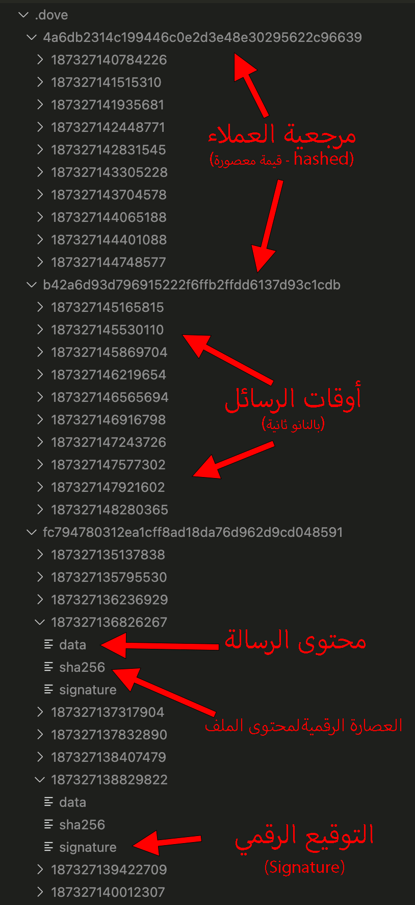
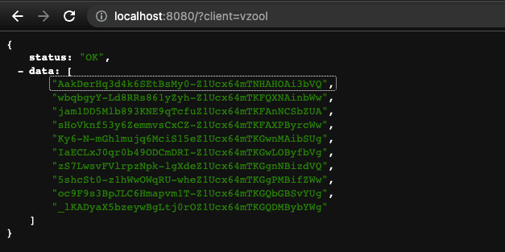

# :bird: الحمامة للتنبيه بنظام الملفات
#### Dove Notification File System (DNFS)

<p>
<a href="https://github.com/vzool/dove.php/blob/main/README.md"></a>
<a href="https://github.com/vzool/dove.php/actions"></a>
<a href="https://packagist.org/packages/vzool/dove.php"></a>
<a href="https://packagist.org/packages/vzool/dove.php"></a>
<a href="https://packagist.org/packages/vzool/dove.php"></a>
</p>

<div dir="rtl">
الحمامة (Dove) هو نظام إعلام يعتمد على نظام تخزين الملفات لتسليم الرسائل، وهو يعمل كتدفق أحادي الاتجاه للبيانات من الخادم إلى العملاء.
لذلك، يضع الخادم الرسائل فقط، وبعد ذلك سيتحقق العملاء من وجود أي تحديثات وفق جداولهم الخاصة.
</div>


<div dir="rtl">
سيقوم DNFS افتراضيًا بتخزين جميع بياناته في دليل `.dove` في نفس الدليل حيث يوجد `dove.php` ،ويمكن تغيير ذلك عن طريق وسيطة `$path` في المُنشئ (constructor):
</div>


```php
# المنشئ (constructor)
$dove = new Dove(
    string $client, # عنوان العميل المستخدم للإشارة
    int $expiration_in_days = 0, # معطل افتراضيًا ، قم بالتخزين إلى الأبد دون إزالة أي ملف
    string $hash_function = 'sha1', # وظيفة تجزئة مدمجة أو أي وظيفة مجهولة تعمل مثل `sha1()`.
    string $path = __DIR__ . '/.dove/'
);
```

<div dir="rtl">
لا يعالج الحمامة (Dove) البيانات المرسلة أو المستلمة بأي طريقة مثل التشفير أو الترميز ، لذا فهو يعمل كجسر لنقل البيانات من الخادم إلى العملاء. إذا كانت لديك بعض المخاوف مثل البيانات الثنائية ، فما عليك سوى تشفيرها باستخدام "base64" وللحفاظ على الخصوصية استخدام التشفير، كل ذلك تُرك لخيارات المطور.
</div>

<div dir="rtl">
يتم تخزين "انتهاء صلاحية الرسائل" مؤقتًا في ذاكرة الطلب عند إنشاء مثيل جديد لكائن الحمامة (Dove)، افتراضيًا تكون قيمته صفرًا مما يعني تعطيل ، وإلا فسيكون في غضون أيام. إذا تم تعطيل انتهاء الصلاحية، فسيقوم DNFS بتخزين جميع الرسائل دون حذف أي منها. لذلك ، يتم حساب عملية الحذف بعد انتهاء الصلاحية وإزالة الرسائل القديمة عند إجراء مكالمة سحب مع عميل معين.
</div>

<div dir="rtl">
DNFS هو ممثل كسول ولا يتطلب أي مهمة مجدولة لتكون نشطة من أجل القيام بعملها ، فهي تنتظر إجراء العميل فقط لتحديث حالة الرسالة.
</div>

### :sparkles: الحافز لفكرة المشروع (Motivation)
<div dir="rtl">
جاءت الفكرة الرئيسية من محادثات مشروع Passky-Server على خادم discord حول ما حدث لخرق بيانات LastPass، والذي يؤثر على معلومات التعريف الشخصية (PII) ويسمح لممثل سيء باستخدام هذه المعلومات لشن هجوم تصيد.
كان هناك العديد من الأفكار المشتركة، إحداها كان Zica Zajc وهو رجل عظيم والمدير التنفيذي لمشروع Passky، واقترح أن الخادم يمكنه تخزين الرسائل وسيقوم العملاء بفحصها لاحقًا.
لذلك ، اعتقدت أنه سيكون من الأفضل للجميع دمج هذه الفكرة في مكتبة قابلة للاستخدام.
</div>

### :eyes: تشريح المكتبة (Anatomy)

<div dir="rtl">
الحمامة (Dove) هي مكتبة صغيرة جدًا تقل عن 120 LOC (سطور من التعليمات البرمجية) ، واستغرق التنفيذ الأساسي 51٪ فقط ، و 14٪ لمعالجة HTTP والباقي للاختبار.
</div>

<div dir="rtl">
نعم ، ملف واحد يحتوي على كل منهم ، ملف `dove.php` يحتوي على التنفيذ ، وجهاز توجيه HTTP ، والاختبار ، أليس هذا رائعًا؟
</div>

<div dir="rtl">
في الواقع ، Dove هي مكتبة خاصة يمكنك من خلالها استخدام الملف الفردي `dove.php` ، أو تثبيته عبر composer دون الحاجة إلى مساحات أسماء. ستجعلك هاتان الطريقتان تستخدم الوظائف الكاملة للمكتبة.
</div>

**هيكلة بيانات نظام الحمامة لتخزين الملفات - Dove Storage Data Structure (DSDS)**



<div dir="rtl">
يمكن أن يكون دليل ".dove" في مسار عام بميزة سرد الدليل إذا كان يدعمه خادم الويب، ولكن يمكنك أيضًا وضعه في موقع خاص وسيكون DNFS هو نقطة الوصول الوحيدة إلى هذه البيانات.
</div>

**طلب السحب - REST API Pull Request**



<div dir="rtl">
كانت تلك قائمة بالأوقات ، بترتيب تنازلي من الأحدث إلى القديم. لذلك ، من خلال تحديد وقت يمكنك طلب أحدث الرسائل بعد ذلك الوقت ، أو قراءة محتويات الرسالة.
</div>

**طلب السحب بعد وقت محدد - REST API Pull Request After Some Time**


**طلب السحب بعد آخر توقيت - REST API Pull Request After Last Time**


**طلب قراءة الرسالة - REST API Read Request**


<div dir="rtl">
يحاول DNFS تطبيق عدم الثقة من خلال وضع حد واضح بين الداخل والخارج ، لذلك فهو دائمًا ما يشفر الأوقات تلقائيًا ، وسيتم تغيير المفتاح المستخدم للتشفير / فك التشفير تلقائيًا ، وفقًا لمحتويات وموقع "dove.php".
لذلك ، إذا حصل العميل على بعض المراجع الزمنية ، فسيتم تحديث محتويات "dove.php" بطريقة ما أو تم تغيير موقع الملف ، فلن تعمل المراجع القديمة ما لم يطلب العميل مراجع جديدة ، ومن ثم يمكن للعميل الحصول على بقية الرسائل ذات المراجع المحدثة.
</div>

### :office: المتطلبات

- PHP 7.3+ (سيتم دعم الإصدارات الأقدم واحدًا تلو الآخر في المستقبل إذا كان ذلك ممكنًا).

### :anchor: التثبيت والاستخدام
<div dir="rtl">
سيبذل مشروع الحمامة (Dove) قصارى جهده ليكون متوافقًا مع جميع إصداراته التي تم إصدارها ، لذلك في إصدارات التطوير المستقبلية ، لن تكون هناك تغييرات جذرية.
</div>

#### :wrench: مكتبة الملف الواحد - Single File Library (من جانب الخادم)

<div dir="rtl">
المكتبة بأكملها عبارة عن ملف واحد يسمى "dove.php" ، لذا يمكنك نسخه ولصقه في أي مكان ذي صلة بك.
</div>

<div dir="rtl">
استخدم ما يلي عندما تريد معالجة الرسائل:
</div>

```php
<?php

define('DOVE', 1);
require_once 'dove.php';

$dove = new Dove('abdelaziz');
$time = $dove->Push('Salam, World!');
$message = $dove->Read($time); # قراءة رسالة في توقيت محدد

$times = $dove->Pull($time); # سحب كل مواقيت الرسائل بعد توقيت محدد
$times = $dove->Pull(); # سحب كل مواقيت الرسائل

$dove->Delete($time); # حذف رسالة واحدة فقط
$dove->Delete(); # حذف كل الرسائل
?>
```

<div dir="rtl">
بعد ذلك ، للتعامل مع طلبات العميل ، قم بتشغيل ما يلي:
</div>

```shell
php -S localhost:8080 dove.php
```

#### :musical_note: مدير الحزم البرمجية - [Composer](https://getcomposer.org/) Dependency Manager for PHP (من جانب الخادم)

```shell
composer require vzool/dove.php
```

<div dir="rtl">
استخدم ما يلي عندما تريد معالجة الرسائل:
</div>

```php
<?php

define('DOVE', 1);
require_once 'vendor/vzool/dove.php/dove.php';

$dove = new Dove('abdelaziz');
$time = $dove->Push('Salam, World!');
$message = $dove->Read($time); # قراءة رسالة في توقيت محدد
# ...
?>
```

<div dir="rtl">
بعد ذلك، للتعامل مع طلبات العميل ، قم فقط بتضمين ذلك في مسار `$ _REQUEST` وسوف يتعامل مع الطلبات تلقائيًا.
</div>

```php
<?php require_once 'vendor/vzool/dove.php/dove.php'; ?>

# أو

<?php
    define('DOVE', 1);
    require_once 'vendor/vzool/dove.php/dove.php';
    Dove::Serve();
?>
```

#### :earth_africa: HTTP REST API (من جانب العميل) [GET/POST/ANY]

- اسحب جميع أوقات الرسائل:
    - `http://localhost:8080/dove.php?client=abdelaziz&cmd=pull`
    أو
    - `http://localhost:8080/dove.php?client=abdelaziz`

- سحب آخر أوقات الرسائل بعد الوقت (369):
    - `http://localhost:8080/dove.php?client=abdelaziz&cmd=pull&time=369`
    أو
    - `http://localhost:8080/dove.php?&client=abdelaziz&time=369`

- سحب اخر اوقات الرسائل بعد الوقت (369) `http://localhost:8080/dove.php?client=abdelaziz&cmd=read&time=369`


### :checkered_flag: قياس الأداء (Benchmark)
- CPU: 3.7 GHz 6-Core Intel Core i5
- RAM: 72 GB 2667 MHz DDR4
- OS: masOS Ventura 13.1
```shell
====================================================================
Dove Benchmarking started at: 2023-01-30 11:19:45
====================================================================
Write messages for 30 sec...
Write finished on: 2023-01-30 11:20:16
--------------------------------------------------------------------
Read all written messages...
Read finished on: 2023-01-30 11:20:21
--------------------------------------------------------------------
Delete all written messages...
Delete finished on: 2023-01-30 11:20:41
====================================================================
Write Count 165,908 (msg) in 30 sec
Write Speed 5,530 (msg/sec).
--------------------------------------------------------------------
Read Count 165,908 (msg) in 5 sec
Read Speed 33,182 (msg/sec).
--------------------------------------------------------------------
Delete Count 165,908 (msg) in 20 sec
Delete Speed 8,295 (msg/sec).
--------------------------------------------------------------------
Average Count 497,724 (msg).
Average Speed 47,007 (msg/sec).
====================================================================
Dove Benchmarking done at: (2023-01-30 11:20:41) and took 55 sec
====================================================================
```
<div dir="rtl">
يمكنك تشغيل الاختبارات المعيارية الخاصة بك على جهاز الكمبيوتر الخاص بك باستخدام الأمر التالي
</div>

`php benchmark.php`

### :microscope: الاختبار البرمجي (Test)

<div dir="rtl">
يجب أن يعمل دون أي مشاكل ، وإلا فسيتم طرح استثناء.
</div>

```bash
php dove.php
# أو
composer test
```