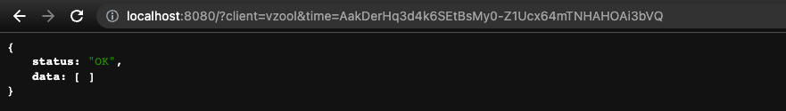

# :bird: Dove Notification File System (DNFS)

<p>
<a href="https://github.com/vzool/dove.php/blob/main/README.ar.md"></a>
<a href="https://github.com/vzool/dove.php/actions"></a>
<a href="https://packagist.org/packages/vzool/dove.php"></a>
<a href="https://packagist.org/packages/vzool/dove.php"></a>
<a href="https://packagist.org/packages/vzool/dove.php"></a>
</p>

Dove is a notification system based on the file storage system to deliver messages, it is working as a one-direction stream of data from the server to the clients.
So, the server just puts the messages, and later the clients will check for any updates on their own schedules.

DNFS by default will store all its data in `.dove` directory in the same directory where `dove.php` is located, this can be changed by `$path` argument in the constructor:

```php
# constructor
$dove = new Dove(
    string $client, # client address used to reference.
    int $expiration_in_days = 0, # disabled by default, store forever without removing any.
    int $integrity = Dove::INTEGRITY_ALL, # level of integrity of the messages.
    string $cmd = '*', # all commands allowed, otherwise start with a limited constructor without `Push` cmd.
    string $path = __DIR__ . '/'
);
```

Dove doesn't process the sent or received data in any way like encryption or encoding, so it just acts like a bridge to transfer data from server to clients. If you have some concerns like binary data just encode them by using `base64` and to maintain privacy use encryption, all that were left to the developer choices.

"**Expiration of Messages**" is temporarily stored in request memory when a new instance of Dove object is created, by default its value is zero which means disabled, otherwise it will be in days. If the expiration is disabled the DNFS will store all the messages without deleting any. So, the delete operation after expiration is calculated and old messages are removed when a Pull call is performed with a specific client.

DNFS is a lazy actor which it does not require any scheduled job to be active in order to do its job, it is only waiting for client action to update the status of the message.

"**Integrity**" is a part of zero-trust that Dove hopes to offer, and it has many options:

```php
class Dove{
    const INTEGRITY_DISABLED = 0b0000;
    const INTEGRITY_GENERATE_HASH = 0b0001;
    const INTEGRITY_VERIFY_HASH = 0b0010;
    const INTEGRITY_GENERATE_SIGNATURE = 0b0100;
    const INTEGRITY_VERIFY_SIGNATURE = 0b1000;
    const INTEGRITY_ALL = 0b1111; # generate and verify for hash and signature
    # ...
}
```

In general, the generation of hash and signature will happen when a new message is pushed by the `Push` command and verification occurs when the `Read` command is called.
The fastest option is `Dove::INTEGRITY_DISABLED` then (`Dove::INTEGRITY_GENERATE_HASH` or `Dove::INTEGRITY_VERIFY_HASH`), then (`Dove::INTEGRITY_GENERATE_SIGNATURE` or `Dove::INTEGRITY_VERIFY_SIGNATURE`), while the slowest option is `Dove::INTEGRITY_ALL` which it depends on the message size. So, you have to do benchmarking in order to select the best option.

To start the server it behaves similarly to the `Dove` constructor:

```php
Dove::Serve(
    true, # Block the execution.
    int $expiration_in_days = 0, # disabled by default, store forever without removing any.
    int $integrity = Dove::INTEGRITY_ALL, # level of integrity of the messages.
    string $path = __DIR__ . '/'
);
```

For integrity parameter is a bitwise variable which you can combine multiple options at once like the following:

```php
$dove = new Dove(
    # ..
    Dove::INTEGRITY_GENERATE_HASH | Dove::INTEGRITY_GENERATE_SIGNATURE, # generate all without verifying
    # ..
);

# AND

Dove::Serve(
    # ..
    Dove::INTEGRITY_GENERATE_HASH | Dove::INTEGRITY_GENERATE_SIGNATURE, # generate all without verifying
    # ..
);
```

### :no_entry: Cryptography Matrix

Cryptography is only limited as an option to message integrity while transfer only, `Dove` deliver the messages as it is, without any encoding or encryption of the message contents.

| Function      | Cipher |  Optional | Changeable   |
| ----------- | ----------- | -----------  | -----------    |
| Client Reference      | BLAKE2b      | **No**  | **No** |
| Message Hash   | SHA-256        |  Yes   |   **No** |
| Message Signature   | Ed25519        | Yes |   **No** |
| Signature Encoding   | base64        |   Yes |   **No** |
| Times Encyption   | Xsals20 + Poly1305        |   **No** |   **No** |
| Times Encoding   | base64url         |    **No** |   **No** |


### :sparkles: Motivation
The main idea came from the [Passky-Server](https://github.com/Rabbit-Company/Passky-Server) project chats on the [discord server](https://discord.gg/y2ZBKbW5TA) about what happened to the LastPass data breach, which affects Personally Identifiable Information (PII) and lets a bad actor uses that information to stage a Phishing-Attack.
There were many ideas shared, one of them was [Zica Zajc](https://github.com/zigazajc007) who is a great man and the CEO of Passky project, he suggested that the server can store the messages and the clients will check them later.
So, I thought it will be a better for everyone to consildate this idea into a usable library.

### :eyes: Anatomy

Dove is a very small library that is less than 180 LOC (lines of code), and the core implementation took only about 59%, 10% for HTTP handling and the rest is for testing.

Yes, one single file has them all, `dove.php` file contains the implementation, HTTP router, and testing, isn't this great? :yum::v:

In fact, Dove is a special library in which you can use the single file `dove.php`, or install it via composer without any namespaces required. Both of these methods will make you use the full functions of the library.

**Dove Storage Data Structure (DSDS)**


The `.dove` directory can be in a public path with a directory listing feature if it does support by the web server, but you can also put it in a private location and DNFS will be the only access point to those data.


**REST API Pull Request**


That was a list of times, in descending order from the newest to the old. So, by selecting a time you can ask for the latest messages after that time, or read the message contents.

**REST API Pull Request After Some Time**


**REST API Pull Request After Last Time**



**REST API Read Request**


DNFS tries to implement zero-trust by making a clear border between inside and outside, so it always encodes times automatically, and the key used to encode/decode will be changed automatically, according to `dove.php` contents, file state and location.

If `dove.php` identity changed then `.dove` entire folder will be deleted automatically.

So, if the client got some time references then the `dove.php` contents got updated somehow or the file location changed, then the old references will not work unless the client asks for new references, and then the client can get the rest of the messages with updated references.

**REST API Read Request with Invalid Signature**


Here the signature is invalid while the hash is valid because the hash is about the message content only, while the signature involves the source code of `dove.php` itself as the source of truth, which has changed and makes all new keypair, then all past signatures are invalid by default.
In a normal situation, and while messages are in transmission the `dove.php` file should not be changed, except if there is an urgent update, so the developer later can decide if this is acceptable or cancel all messages and create new ones if needed.

**REST API Read Request with Missing Message**


### :office: Requirements

- PHP 7.3+

### :anchor: Installation & Usage
Dove project will do its best to be compatible with all its released versions, so in future development releases, there will be no breaking changes.
#### :wrench: Single File Library (Server-Side)

The whole library is just a single file called `dove.php`, so you can just copy and paste it where ever is relevant to you.

Use the following when you want to process messages:

```php
<?php

define('DOVE', 1);
require_once 'dove.php';

$dove = new Dove('abdelaziz');
$result = $dove->Push('Salam, World!');
$message = $dove->Read($result['time']); # time just act like id

$times = $dove->Pull($result['time']); # all times of messages after `$time`
$times = $dove->Pull(); # all times of messages

$dove->Delete($result['time']); # delete one message
$dove->Delete(); # delete all messages
?>
```

Then, to handle client requests run the following:

```shell
php -S localhost:8080 dove.php
```

#### :musical_note: [Composer](https://getcomposer.org/) Dependency Manager for PHP (Server-Side)

```shell
composer require vzool/dove.php
```
Use the following when you want to process messages:
```php
<?php

define('DOVE', 1);
require_once 'vendor/vzool/dove.php/dove.php';

$dove = new Dove('abdelaziz');
$result = $dove->Push('Salam, World!');
$message = $dove->Read($result['time']); # time act like id
# ...
?>
```
Then, to handle client requests only include this in the path of `$_REQUEST` and it will handle the requests automatically.
```php
<?php require_once 'vendor/vzool/dove.php/dove.php'; ?>

# OR

<?php
    define('DOVE', 1);
    require_once 'vendor/vzool/dove.php/dove.php';
    Dove::Serve(true);
?>
```

#### :earth_africa: HTTP REST API (Client-Side) [GET/POST/ANY]

- Pull all times of messages:
    - `http://localhost:8080/dove.php?client=abdelaziz&cmd=pull`
    or
    - `http://localhost:8080/dove.php?client=abdelaziz`

- Pull the latest times of messages after the time (369):
    - `http://localhost:8080/dove.php?client=abdelaziz&cmd=pull&time=369`
    or
    - `http://localhost:8080/dove.php?&client=abdelaziz&time=369`

- Read a message in its time `http://localhost:8080/dove.php?client=abdelaziz&cmd=read&time=369`

### :checkered_flag: Benchmark
- CPU: 3.7 GHz 6-Core Intel Core i5
- RAM: 72 GB 2667 MHz DDR4
- OS: masOS Ventura 13.1


```shell


INTEGRITY_TYPE = Dove::INTEGRITY_DISABLED

==========================================================================
Dove Benchmarking started at: 2023-02-20 14:04:55
==========================================================================
Write messages for (00:00:30) ...
Write finished on: 2023-02-20 14:05:26
--------------------------------------------------------------------------
Read all written messages...
Read finished on: 2023-02-20 14:05:38
--------------------------------------------------------------------------
Delete all written messages...
Delete finished on: 2023-02-20 14:06:09
==========================================================================
Write Count 126,061 (msg) in (00:00:30)
Write Speed 4,202 (msg/sec).
--------------------------------------------------------------------------
Read Count 126,061 (msg) in (00:00:12)
Read Speed 10,505 (msg/sec).
--------------------------------------------------------------------------
Delete Count 126,061 (msg) in (00:00:31)
Delete Speed 4,066 (msg/sec).
--------------------------------------------------------------------------
Average Count 126,061 (msg).
Average Speed 6,258 (msg/sec).
==========================================================================
Dove Benchmarking done at: (2023-02-20 14:06:09) and took (00:01:13)
==========================================================================


INTEGRITY_TYPE = Dove::INTEGRITY_GENERATE_HASH

==========================================================================
Dove Benchmarking started at: 2023-02-20 14:06:09
==========================================================================
Write messages for (00:00:30) ...
Write finished on: 2023-02-20 14:06:40
--------------------------------------------------------------------------
Read all written messages...
Read finished on: 2023-02-20 14:07:03
--------------------------------------------------------------------------
Delete all written messages...
Delete finished on: 2023-02-20 14:07:26
==========================================================================
Write Count 93,540 (msg) in (00:00:30)
Write Speed 3,118 (msg/sec).
--------------------------------------------------------------------------
Read Count 93,540 (msg) in (00:00:23)
Read Speed 4,067 (msg/sec).
--------------------------------------------------------------------------
Delete Count 93,540 (msg) in (00:00:23)
Delete Speed 4,067 (msg/sec).
--------------------------------------------------------------------------
Average Count 93,540 (msg).
Average Speed 3,751 (msg/sec).
==========================================================================
Dove Benchmarking done at: (2023-02-20 14:07:26) and took (00:01:16)
==========================================================================


INTEGRITY_TYPE = Dove::INTEGRITY_VERIFY_HASH

==========================================================================
Dove Benchmarking started at: 2023-02-20 14:07:26
==========================================================================
Write messages for (00:00:30) ...
Write finished on: 2023-02-20 14:07:57
--------------------------------------------------------------------------
Read all written messages...
Read finished on: 2023-02-20 14:08:05
--------------------------------------------------------------------------
Delete all written messages...
Delete finished on: 2023-02-20 14:08:33
==========================================================================
Write Count 119,980 (msg) in (00:00:30)
Write Speed 3,999 (msg/sec).
--------------------------------------------------------------------------
Read Count 119,980 (msg) in (00:00:08)
Read Speed 14,998 (msg/sec).
--------------------------------------------------------------------------
Delete Count 119,980 (msg) in (00:00:28)
Delete Speed 4,285 (msg/sec).
--------------------------------------------------------------------------
Average Count 119,980 (msg).
Average Speed 7,761 (msg/sec).
==========================================================================
Dove Benchmarking done at: (2023-02-20 14:08:33) and took (00:01:06)
==========================================================================


INTEGRITY_TYPE = Dove::INTEGRITY_GENERATE_HASH | Dove::INTEGRITY_VERIFY_HASH

==========================================================================
Dove Benchmarking started at: 2023-02-20 14:08:33
==========================================================================
Write messages for (00:00:30) ...
Write finished on: 2023-02-20 14:09:04
--------------------------------------------------------------------------
Read all written messages...
Read finished on: 2023-02-20 14:09:11
--------------------------------------------------------------------------
Delete all written messages...
Delete finished on: 2023-02-20 14:09:40
==========================================================================
Write Count 77,086 (msg) in (00:00:30)
Write Speed 2,570 (msg/sec).
--------------------------------------------------------------------------
Read Count 77,086 (msg) in (00:00:07)
Read Speed 11,012 (msg/sec).
--------------------------------------------------------------------------
Delete Count 77,086 (msg) in (00:00:29)
Delete Speed 2,658 (msg/sec).
--------------------------------------------------------------------------
Average Count 77,086 (msg).
Average Speed 5,413 (msg/sec).
==========================================================================
Dove Benchmarking done at: (2023-02-20 14:09:40) and took (00:01:06)
==========================================================================


INTEGRITY_TYPE = Dove::INTEGRITY_GENERATE_SIGNATURE

==========================================================================
Dove Benchmarking started at: 2023-02-20 14:09:40
==========================================================================
Write messages for (00:00:30) ...
Write finished on: 2023-02-20 14:10:11
--------------------------------------------------------------------------
Read all written messages...
Read finished on: 2023-02-20 14:10:16
--------------------------------------------------------------------------
Delete all written messages...
Delete finished on: 2023-02-20 14:10:41
==========================================================================
Write Count 67,758 (msg) in (00:00:30)
Write Speed 2,259 (msg/sec).
--------------------------------------------------------------------------
Read Count 67,758 (msg) in (00:00:05)
Read Speed 13,552 (msg/sec).
--------------------------------------------------------------------------
Delete Count 67,758 (msg) in (00:00:25)
Delete Speed 2,710 (msg/sec).
--------------------------------------------------------------------------
Average Count 67,758 (msg).
Average Speed 6,174 (msg/sec).
==========================================================================
Dove Benchmarking done at: (2023-02-20 14:10:41) and took (00:01:00)
==========================================================================


INTEGRITY_TYPE = Dove::INTEGRITY_VERIFY_SIGNATURE

==========================================================================
Dove Benchmarking started at: 2023-02-20 14:10:41
==========================================================================
Write messages for (00:00:30) ...
Write finished on: 2023-02-20 14:11:12
--------------------------------------------------------------------------
Read all written messages...
Read finished on: 2023-02-20 14:11:19
--------------------------------------------------------------------------
Delete all written messages...
Delete finished on: 2023-02-20 14:11:46
==========================================================================
Write Count 99,785 (msg) in (00:00:30)
Write Speed 3,326 (msg/sec).
--------------------------------------------------------------------------
Read Count 99,785 (msg) in (00:00:07)
Read Speed 14,255 (msg/sec).
--------------------------------------------------------------------------
Delete Count 99,785 (msg) in (00:00:27)
Delete Speed 3,696 (msg/sec).
--------------------------------------------------------------------------
Average Count 99,785 (msg).
Average Speed 7,092 (msg/sec).
==========================================================================
Dove Benchmarking done at: (2023-02-20 14:11:46) and took (00:01:04)
==========================================================================


INTEGRITY_TYPE = Dove::INTEGRITY_GENERATE_SIGNATURE | Dove::INTEGRITY_VERIFY_SIGNATURE

==========================================================================
Dove Benchmarking started at: 2023-02-20 14:11:46
==========================================================================
Write messages for (00:00:30) ...
Write finished on: 2023-02-20 14:12:17
--------------------------------------------------------------------------
Read all written messages...
Read finished on: 2023-02-20 14:12:26
--------------------------------------------------------------------------
Delete all written messages...
Delete finished on: 2023-02-20 14:12:45
==========================================================================
Write Count 64,287 (msg) in (00:00:30)
Write Speed 2,143 (msg/sec).
--------------------------------------------------------------------------
Read Count 64,287 (msg) in (00:00:09)
Read Speed 7,143 (msg/sec).
--------------------------------------------------------------------------
Delete Count 64,287 (msg) in (00:00:19)
Delete Speed 3,384 (msg/sec).
--------------------------------------------------------------------------
Average Count 64,287 (msg).
Average Speed 4,223 (msg/sec).
==========================================================================
Dove Benchmarking done at: (2023-02-20 14:12:45) and took (00:00:58)
==========================================================================


INTEGRITY_TYPE = Dove::INTEGRITY_ALL

==========================================================================
Dove Benchmarking started at: 2023-02-20 14:12:45
==========================================================================
Write messages for (00:00:30) ...
Write finished on: 2023-02-20 14:13:16
--------------------------------------------------------------------------
Read all written messages...
Read finished on: 2023-02-20 14:13:24
--------------------------------------------------------------------------
Delete all written messages...
Delete finished on: 2023-02-20 14:13:44
==========================================================================
Write Count 52,978 (msg) in (00:00:30)
Write Speed 1,766 (msg/sec).
--------------------------------------------------------------------------
Read Count 52,978 (msg) in (00:00:08)
Read Speed 6,622 (msg/sec).
--------------------------------------------------------------------------
Delete Count 52,978 (msg) in (00:00:20)
Delete Speed 2,649 (msg/sec).
--------------------------------------------------------------------------
Average Count 52,978 (msg).
Average Speed 3,679 (msg/sec).
==========================================================================
Dove Benchmarking done at: (2023-02-20 14:13:44) and took (00:00:58)
==========================================================================
==========================================================================
Dove Benchmarking done at: (2023-02-20 14:13:44) and all took (00:08:41)
==========================================================================
```

You can run your own benchmarks on your PC with the following command `php benchmark.php`
### :microscope: Test

It should work without any issues, otherwise, an exception will be thrown. 

```bash
php dove.php
# OR
composer test
```

### :crystal_ball: Future Development

`DNFS` library can be part of your own Cloud ecosystem in which there are installed applications for services in the client's device and those app clients pull status and notification from the cloud on regular basis, just like Google they have "Google Play Services" or Huawei with their app HMS (Huawei Mobile Services), of course, Google and Huawei are big companies which they always building their own technology infrastructure, but, `Dove` can give you something that tasty, simple and reliable.

**Don't forget that Google company started from the Garage, So start building your Garage.** :joy::v: